# Manual de instalación para Spfx

### Instalación de NVM 
NVM es un gestor de versiones de Node.js, que nos permite tener varias versiones de Node.js instaladas en nuestro equipo y cambiar entre ellas fácilmente.

Para instalar NVM, debemos ejecutar el archivo exe de instalación que se encuentra en el siguiente enlace: [NVM](https://github.com/coreybutler/nvm-windows/releases/download/1.1.12/nvm-setup.exe)

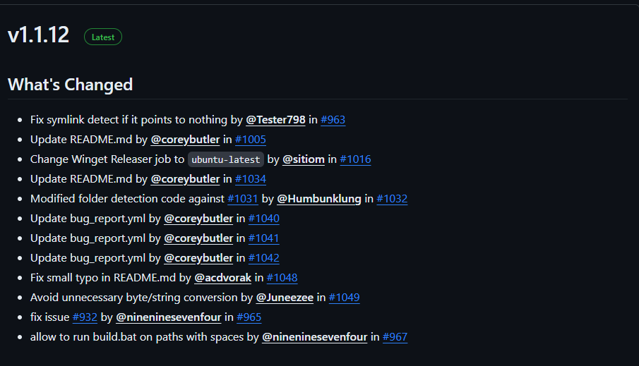

Una vez instalado, abrimos una consola de comandos y ejecutamos el siguiente comando para verificar que se instaló correctamente es importante señalar que se debe ejecutar con privilegios de administrador:

```sh
nvm --version
```
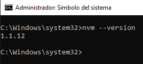

### Instalación de Node.js

Para instalar Node.js, debemos ejecutar el siguiente comando en la consola de comandos:

```sh
nvm install 18.19.0
```
_Nota: Para que Spfx funcione correctamente, es necesario instalar la una version LTS de Node.js que sea entre la 16.Xx  y la 18.Xx._

una vez instalado, ejecutamos el siguiente comando para verificar que se instaló correctamente:

```sh
node --version
```
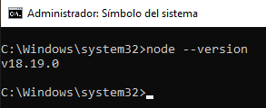

Para verificar las versiones de Node.js instaladas en nuestro equipo, ejecutamos el siguiente comando:

```sh
nvm list
```
### Instalación de Yeoman

Para instalar Yeoman, debemos ejecutar el siguiente comando en la consola de comandos:

```sh
npm install -g yo@4.3.1
```
una vez instalado, ejecutamos el siguiente comando para verificar que se instaló correctamente:

```sh
yo --version
```
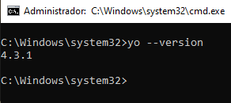

Nota: Para que Spfx funcione correctamente, es necesario instalar la versión 4.x de Yeoman.

### Instalación de Gulp y @microsoft/generator-sharepoint

Para instalar Gulp, debemos ejecutar el siguiente comando en la consola de comandos:

```sh
npm install gulp-cli @microsoft/generator-sharepoint --global
```

una vez instalado para generar el proyecto de Spfx primero tenemos que crear una carpeta donde se va a generar el proyecto, luego nos ubicamos en la carpeta que acabamos de crear y ejecutamos el siguiente comando con privilegios de administrador:

```sh
    yo 
```
y se despelgara el siguiente menu  :

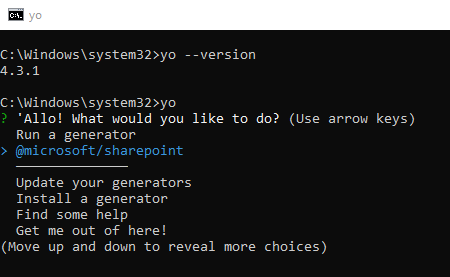

Seleccionamos la opción @microsoft/sharepoint y presionamos enter y esperamos.

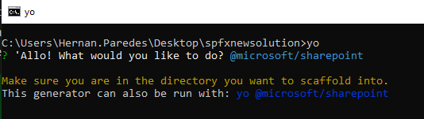 

Aparecerá el siguiente menu donde nos pedira el nombre de la solucion:
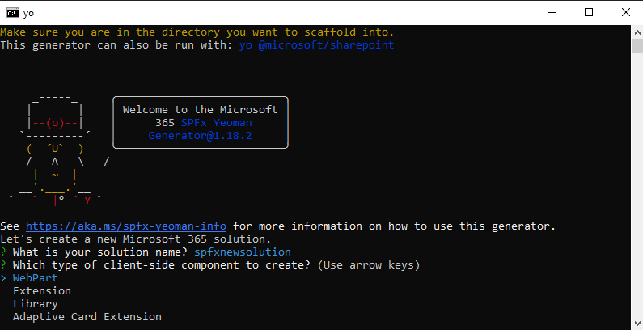

Seleccionamos la oción WebPart y presionamos enter , despues pedira el nombre de la web part.
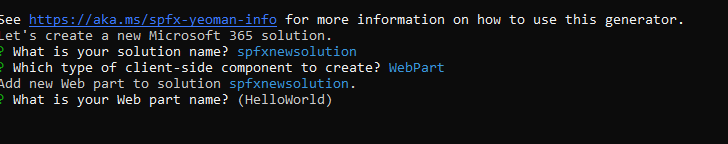

Luego el tipo de plantilla de la web part donde se seleccionamos React y damos enter.

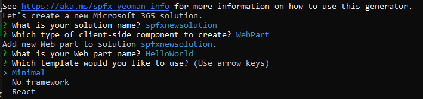 


Se generara el proyecto y se instalara las dependencias necesarias para el proyecto.

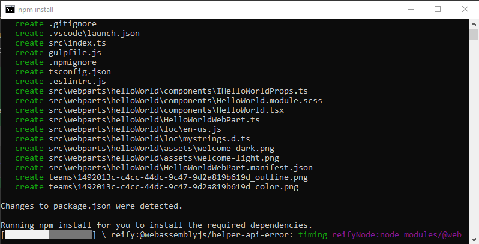

Una vez terminado el proceso de instalación de dependencias se generara el proyecto de Spfx.

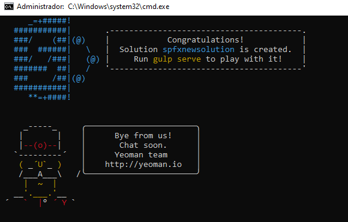

Para correrlo es necesario modificar la configuracion del servidor para eso nos dirigimos a ```{nombreDeLaSolucion}\config\serve.json```.

Dentro del archivo **serve.json** buscamos initialPage y cambiamos el valor por  ```"https://ngkinsulators.sharepoint.com//_layouts/workbench.aspx"```

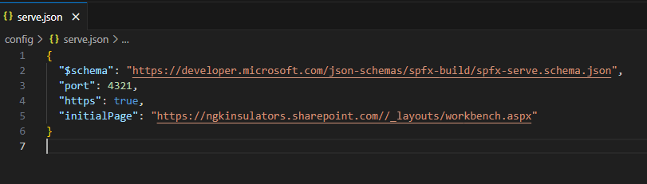

Luego nos dirigimos a la capeta de la solucion en la terminal y ejecutamos el siguiente comando:

```sh
gulp trust-dev-cert
```
despues ejecutamos el siguiente comando para correr el proyecto:

```sh
gulp serve
```
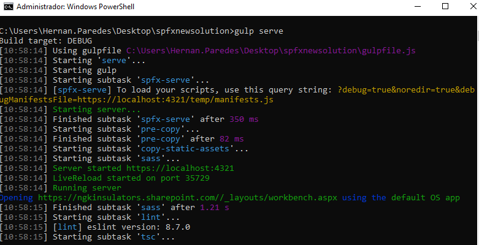

Se abrira una ventana del navegador esperar un poco y actualizara la pagina hasta que aparezca la web part como un elemento agregable.

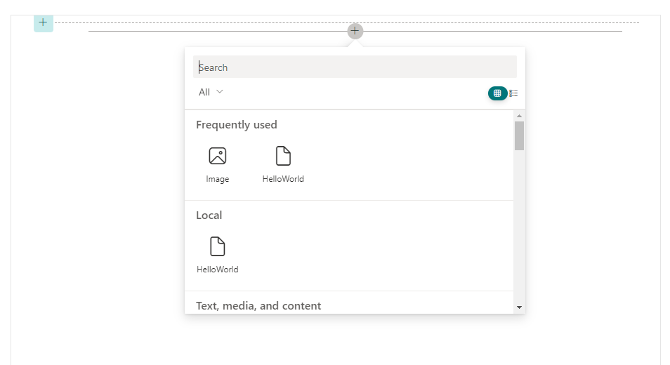

